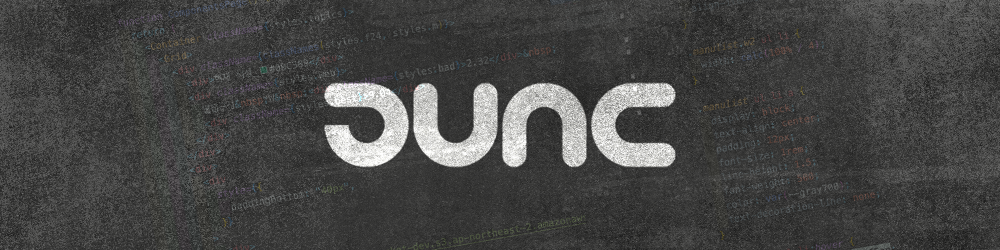

<!-- #### ”Simplicity is about subtracting the obvious, and adding the meaningful” - John Maeda
  -->

  
  

  <samp>
    🧑‍💻 Hi there! I'm Full-Stack Designer with expertise in UI/UX and web development. 
    🔥 With 8 years of experience in design and 3 years in web development, I bring a deep understanding of creating and implementing user-centered solutions. 
    🔍 My research interests include IoT, UX & Interaction Design, and Public Design. I am passionate about exploring how technology and design intersect to enhance user experiences. 
    🙌 I am dedicated to designing and developing beautiful, functional, and impactful solutions across various platforms.
  </samp>

 

<!-- 

  
  
  
  
  
  
  
  

  

 -->

<!-- ## GitHub -->
<!--  -->
<!--  -->
